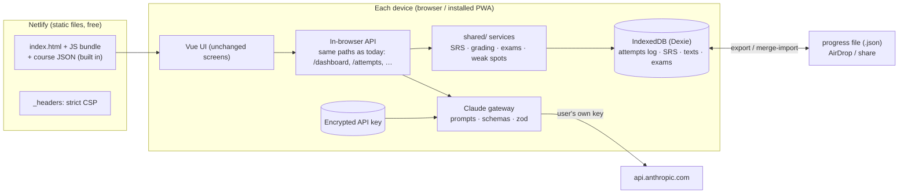
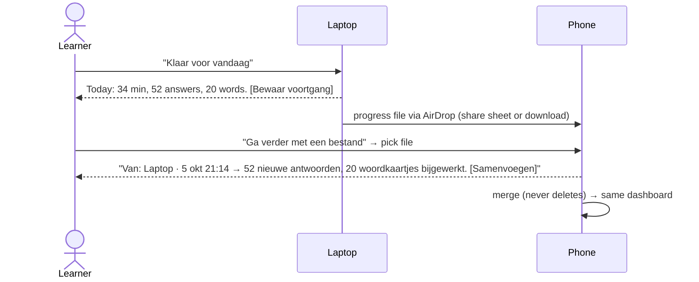

# Sharing the A2 Trainer with friends — production-readiness plan

> Status: **decided, building.** Steps 0–2 done: plan + SPEC updated; services and `DataStore` in `shared/`; the course is validated and bundled at build time (`virtual:course-data`). The Express server is left untouched (and later deleted) until step 3 switches the UI over.
> Companion to `SPEC.md`, which describes the app as built in phases 1–7: one learner, one computer.
> This document changes some of SPEC's hard constraints (§3 of SPEC). Step 0 below updates SPEC to match.

---

## 1. Summary

We turn the app into a **local-first web app**:

- **Hosting:** static files on **Netlify**. No server of ours, no database, no login, and no friend data on our side.
- **Storage:** each friend's progress lives **in their own browser** (IndexedDB).
- **Claude:** each friend **brings their own Claude API key** (BYOK). It is remembered on each device and sent
  only to Anthropic.
- **Switching devices:** a **"Klaar voor vandaag"** (finish session) button saves a **progress file**. The
  learner AirDrops that file to their phone (or back) and continues there. Importing **merges**, so it never
  throws progress away.
- **The Express server is removed** once the browser version works.

Why: the app as it is shares one progress and one API key with everybody who opens it, and Netlify cannot
run it. See the analysis in §9.

---

## 2. Decisions

| # | Question | Decision |
| --- | --- | --- |
| 1 | Phones vs laptops, two devices? | Both. Keep devices aligned with a **finish-session button + progress file** (AirDrop). The key is set up per device. → §4 |
| 2 | Direction | **Local-first + BYOK** |
| 3 | Hosting | **Netlify** |
| 4 | New dependencies | **Approved:** `dexie`, `vite-plugin-pwa`, `@playwright/test` (dev) |
| 5 | Key storage | **Remember the key** on the device, with the protections in §5 |
| 6 | Content review | **No native speaker for now.** Use a Claude-assisted review pass + a "Meld een fout" button on every item; colleagues review if they can. → §7 |
| 7 | Express server | **Remove** once the browser version works |

---

## 3. Architecture



### 3.1 The trick that keeps the migration small: same API, different transport

Today the UI makes 28 calls like `api.get("/dashboard")` against Express. We keep **the exact same paths and
response shapes**, but `src/api/client.ts` dispatches them to an **in-browser router** instead of `fetch`. Each
handler is the logic that is in `server/routes/*.ts` today, moved into `shared/services/` and working against a
`DataStore` interface instead of JSON files.

- The screens barely change, so the risk is low.
- Error responses keep the `{ error: { code, message } }` format, so `ApiRequestError` and every Dutch message
  keep working.
- Services are tested against an **in-memory `DataStore`** in Vitest (fast), and the browser uses the
  **Dexie `DataStore`**.

### 3.2 Data model v2 (IndexedDB via Dexie)

The core idea: **facts are append-only events with unique ids; totals are derived from them.** Merging two
devices is then simply "union of events", with no double counting.

| Store | Key | Content | Merge rule on import |
| --- | --- | --- | --- |
| `attempts` | `id` (UUID) | every answer: itemId, correct, answer, durationMs, at, deviceId. Also exam answers and writing-error tags (`writing:*`) | **Union** (dedupe by id) |
| `units` | `unitId` | status, bestScore, attempts, stepIndex, completedAt, `updatedAt` | `bestScore` = max, `status` = completed wins, rest = newest `updatedAt` |
| `srsCards` | `cardId` | box, due, reps, lapses, lastReviewedAt, `updatedAt` | Newest `updatedAt` wins |
| `writing` | `id` | text, exerciseId, submittedAt, feedback | **Union**; for the same id, keep the version with feedback |
| `examResults` | `id` | as today + `updatedAt` | Union; same id → finished wins, else newest |
| `explanations` | cache key | Claude explanation | Union |
| `generated` | exercise id | Claude-made exercise, unitId, hidden, createdAt | Union; `hidden` = true if hidden on any device |
| `flags` | `id` | "Meld een fout": itemId, note, at | Union |
| `kv` | name | `settings` (never the key), `lastLocation`, `srsNewToday`, `meta` (deviceId, deviceName, lastExportAt, lastImportAt) | Settings / lastLocation: newest wins |
| `secrets` | `apiKey` | encrypted key + its CryptoKey (§5) | **Never exported, never imported** |

**Derived (not stored, or cached and rebuilt):** per-item stats (`seen`, `correct`, `lastCorrect`),
`minutesByDay`, the streak, weak spots and the dashboard. All of these come from the `attempts` log. That is why
a merge cannot double-count.

**Exam timer note:** an exam in progress uses wall-clock time (`startedAt`). If you hand over mid-exam, the
clock keeps running, as it does today.

---

## 4. Finish session & device handover (decision 1)

### 4.1 The flow



### 4.2 What we build

- **"Klaar voor vandaag" button**: in the top bar (desktop), the sidebar menu (mobile) and the unit end screen.
  It opens a dialog with today's summary and two actions:
  - **"Bewaar voortgang"**: on phones and Safari it uses the **Web Share API with a file** (the share sheet
    shows **AirDrop**). Elsewhere it **downloads** `inburgering-a2-voortgang-2026-10-05-laptop.json`.
  - **"Sluiten"**: just a nice end of the day, with no file.
- **"Ga verder met een bestand"** (in Settings and on the welcome screen): file picker → validate → **preview of
  what changes** → merge.
- **Safety:**
  - Importing an *older* file never loses newer work, because merge rules only add or take the newest.
  - We make an automatic local snapshot before each import, so "undo last import" is possible.
- **Gentle reminder:** "Laatste keer bewaard: 3 dagen geleden" on the dashboard when there is unsaved work older
  than 2 days.
- **Device name:** asked once, for example "Laptop" or "iPhone". It is shown in the import preview.

### 4.3 File format

```jsonc
{
  "format": "inburgering-a2-progress",
  "version": 2,
  "exportedAt": "2026-10-05T19:14:00Z",
  "device": { "id": "…uuid…", "name": "Laptop" },
  "contentVersion": "2026.10.05",          // course build, to detect id changes
  "data": { "attempts": [...], "units": [...], "srsCards": [...], "writing": [...],
            "examResults": [...], "explanations": [...], "generated": [...], "flags": [...],
            "settings": {...}, "lastLocation": {...} }
  // never: the API key
}
```

- Validated with zod on import. Unknown future versions are refused with a Dutch message.
- **Migration from today's version:** the importer also accepts the current `/api/export` file (v1). You run it
  once on the old local version, then import into the new one. The v1 `items` counts have no individual attempts,
  so the importer creates **synthetic attempts** for them, which keeps the derived stats the same.

---

## 5. Protecting a remembered API key (decision 5)

**The honest answer first:** a web page cannot fully hide a secret from code that runs **on that same page**. If a
malicious script ever runs inside our app (cross-site scripting, a poisoned npm package), it can use the key the
same way the app does. No storage choice changes that: localStorage, sessionStorage, IndexedDB or encrypted.
So the strategy is: **(1) make it very hard for hostile code to run on our page, (2) make it very hard for a
stolen key to leave, (3) keep the damage small if it does leak.**

| Who could get the key | Protection |
| --- | --- |
| **Hostile script on our page** (XSS, compromised dependency) | Strict **CSP**: `script-src 'self'` (no inline scripts, no `eval`), no third-party scripts, no analytics, no CDNs. Trusted Types for `v-html` (`require-trusted-types-for 'script'` with one app policy that only accepts our markdown output; check it works with Vue in step 11 and drop it if it breaks rendering). Markdown always with `html: false` (already so). Few dependencies, lockfile, `npm audit` + Dependabot in CI |
| **A stolen key leaving the page** | CSP `connect-src 'self' https://api.anthropic.com` blocks `fetch` to anywhere else. `img-src`, `form-action`, `frame-src` and `base-uri` are locked down too. A script can still try tricks, but every easy exit is closed |
| **Someone copying browser storage / a leaked backup / the progress file** | The key is **encrypted at rest**: AES-GCM with a **non-extractable WebCrypto key**, both kept in IndexedDB. Copying the storage files gives an encrypted blob plus a key that can't be read out. The key is **never** in progress files, exports, logs, URLs or error messages |
| **Malicious browser extension / malware on the device** | We can't stop this. Advise friends to use a browser profile without unknown extensions |
| **Someone using your unlocked device** | Masked display only (`sk-ant-…abcd`), no "show key" button. "Sleutel verwijderen" in Settings |
| **Damage control (works in every case)** | Guide friends to create a **dedicated key** for this app and a **monthly spend limit** in the Anthropic Console. They can see usage there and revoke the key in one click if a device is lost |

Also:

- The key is used **only** by the Claude gateway module. Nothing else imports the secrets store.
- A CSP violation report goes to the browser console only (we have no server to send reports to).
- We **don't** ask for a passphrase on every visit. You chose comfort, and with the protections above that is a
  reasonable trade-off for personal keys with spend limits.

---

## 6. Other building-block changes

1. **Content bundled at build time:** `import.meta.glob("/data/course/**/*.json")`. The index building from
   `server/db/contentRepo.ts` moves to `shared/content/`. `npm run validate` runs **before** `vite build`, so a
   broken content file fails the deploy.
2. **Claude-made exercises are user data** (`generated` store), never in `data/course/`.
3. **Claude prompts, schemas and services** move from `server/claude/` to `shared/claude/`. The gateway uses the
   SDK with `dangerouslyAllowBrowser: true`. The model list stays (default `claude-sonnet-5-5`).
4. **PWA** (`vite-plugin-pwa`): installable, works offline for everything except Claude, and calls
   `navigator.storage.persist()`. Strongly advised on iPhone: Safari may clear storage for sites that are not
   added to the home screen.
5. **"Over deze app" / welcome screen** (Dutch): what it is, "not affiliated with DUO", everything stays on this
   device, how to move progress (§4), and an optional key guide.
6. **Node scripts stay:** `validate` and `stats` are tooling, not server code. They keep running under `tsx`.

---

## 7. Content quality without a native speaker (decision 6)

1. **Claude-assisted review pass** (run during development, not in the app): a script sends each unit's text,
   in batches, for a review of grammar, naturalness, A2 level, wrong answers and ambiguous distractors. It writes
   `docs/content-review.md` with findings per item id. We fix what is clearly right and mark doubtful points for
   colleagues.
2. **"Meld een fout" on every item** (lessons, exercises, exam questions). A short note is saved to `flags`. Flags
   travel in progress files, so a friend can send you their file and you run
   `npm run flags -- <file>` to get a list with item ids and notes.
3. **Colleagues, if available:** give them `docs/content-review.md` plus a printed sample per module.

---

## 8. Work plan

Each step ends with `npm run validate`, `npm test` and `npm run build` green, and you review the diff before
committing (no commits by Claude). Sizes: S ≈ 1–2 h, M ≈ half a day, L ≈ a day or more.

| # | Step | Size | Done when |
| --- | --- | --- | --- |
| 0 | **Prep:** new branch `local-first`; update `SPEC.md` hard constraints (browser storage, BYOK, Netlify); install `dexie`, `vite-plugin-pwa`, `@playwright/test` | S | SPEC and this document agree |
| 1 | **`DataStore` interface + in-memory store; move route logic to `shared/services/`**: attempts-derived stats, units, SRS, practice, dashboard, exams, writing, generated, explanations | L | Existing tests pass; new service tests cover merge-relevant behaviour (stats derived from attempts, exam submit, SRS review) |
| 2 | **Content in the bundle** (`shared/content/`), validation before build ✅ | M | `npm run build` fails on a broken course file; the course is its own lazy chunk (~120 kB gzipped). *Showing the modules with no server running needs the in-browser API, so that check moves to step 3* |
| 3 | **In-browser router + Dexie store**; `api/client.ts` switches transport | L | Every screen works with the dev server stopped; refresh keeps progress; resume-at-step and exam resume still work |
| 4 | **Claude in the browser (BYOK):** gateway, encrypted key store, test key, remove key, usage counter | M | Feedback / explain / generate work with a real key; the network tab shows only `api.anthropic.com`; the key is never in IndexedDB as plain text |
| 5 | **Progress file:** export, share (Web Share + AirDrop), merge-import with preview, undo last import, v1 importer, "Klaar voor vandaag" dialog, reminder | L | Laptop → phone → laptop round trip keeps everything; importing an old file changes nothing; your current local progress imports correctly |
| 6 | **Welcome / "Over deze app" + key guide + DUO disclaimer** | S | A friend can start without help |
| 7 | **"Meld een fout"** on every item + `npm run flags` script | S | Flag on phone → export → script lists it |
| 8 | **PWA** + `storage.persist()` | M | Installable on iPhone/Android; lessons work in airplane mode |
| 9 | **Remove Express:** delete `server/` routes and index (keep `server/scripts/` → move to `scripts/`), update `package.json` scripts and README | S | `npm run dev` = Vite only; no `/api` proxy |
| 10 | **CI + E2E:** GitHub Actions (validate, test, build, `npm audit`); Playwright on a phone viewport: lesson → refresh → resume; exam → refresh → resume; export → import in a fresh context | M | Green checks on every push |
| 11 | **Netlify:** `netlify.toml` (build command, SPA redirect), `_headers` (CSP §5, `X-Content-Type-Options`, `Referrer-Policy: no-referrer`, `Permissions-Policy`), deploy from `main`, previews per branch | S | Public HTTPS URL; CSP active with no console violations |
| 12 | **Claude-assisted content review** → `docs/content-review.md` → fixes | M | Review report done; clear errors fixed |
| 13 | **Beta** with 2–3 friends for a week | — | Their top issues are written down here and fixed |

Order matters: 1 → 2 → 3 is the backbone. 4, 5, 6, 7 and 8 can be done in any order after 3. 9 comes after 3–5
work. 10–11 come last, before friends get the link.

---

## 9. Background: why not deploy as it is

| Area | Today | Problem when shared |
| --- | --- | --- |
| Users | One learner, no login | Everyone would share one progress |
| Storage | JSON files on the server's disk | Netlify has no persistent disk; on a VM everyone writes to the same files |
| API key | One key on the server | Visitors spend your money, and `PUT /api/settings` even lets them replace it |
| Generated exercises | Written into the shared content folder | One person's items show up for everyone |
| Hosting | Netlify can't run Express + files; AWS could (VM), but that brings the problems above, plus auth, backups and GDPR duties for friends' data | |

---

## 10. Risks

| Risk | Mitigation |
| --- | --- |
| Browser clears storage (private mode, iPhone Safari without home-screen install) | PWA install advice, `storage.persist()`, finish-session file, reminder |
| Learner forgets to bring the file to the other device | The import preview shows how old the file is; merge means late imports still work |
| Same day on two devices without a handover | Merge handles it: attempts union, newest SRS card wins (a card reviewed on both devices keeps the newest review) |
| Key leak | §5: CSP, encryption at rest, dedicated key + spend limit, easy revoke |
| Content mistakes | §7: Claude review pass, flags, colleagues |
| Content ids change between releases | `contentVersion` in the file + a CI check that ids from the previous release still exist |
| Claude returns unexpected JSON | Already handled: zod validation and a Dutch error; the text is saved first |
| Someone thinks it's an official DUO product | "Niet van DUO" on the welcome screen and in the footer; exam disclaimers already exist |

---

## 11. Later (not in this plan)

- Real sync between devices (Supabase or similar behind the same `DataStore`). That makes us the controller of
  friends' data (GDPR).
- Chat tutor (SPEC §10.5).
- Speaking practice.
